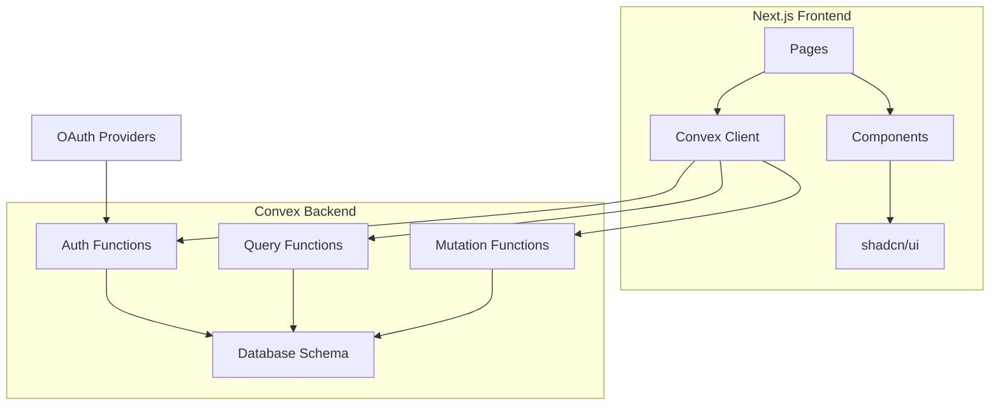

# StewardSync Implementation Plan

## Project Overview
StewardSync is a unified application for reviewing racing steward reports. The application allows users to report incidents, stewards to review them, and head stewards/event managers to finalize reports.

## Technology Stack
- **Frontend Framework**: Next.js 14+ (App Router)
- **Runtime**: Bun (instead of Node.js)
- **Backend/Database**: Convex
- **Authentication**: Convex Auth with OAuth providers (Google, GitHub)
- **UI Components**: shadcn/ui
- **Styling**: Tailwind CSS
- **TypeScript**: Full type safety throughout

## Architecture Overview



## Database Schema Design

### Convex Schema Structure

```typescript
// roles
{
  _id: Id<"roles">;
  RoleName: "Driver" | "Steward" | "Head Steward" | "Event Manager" | "Admin";
}

// users
{
  _id: Id<"users">;
  UserName: string;
  Role: Id<"roles">;
  email: string; // from OAuth
  tokenIdentifier: string; // from Convex Auth
  createdAt: number;
}

// drivers
{
  _id: Id<"drivers">;
  DriverNumber: number;
  DriverName: string;
  ExternalId: string;
  DriverClass: string;
}

// events
{
  _id: Id<"events">;
  Series: string;
  EventNumber: number;
  TrackName: string;
  EventDate: number; // timestamp
}

// races
{
  _id: Id<"races">;
  Event: Id<"events">;
  RaceNumber: number;
}

// reports
{
  _id: Id<"reports">;
  ReportDate: number; // timestamp, auto-generated
  ReportingDriver: Id<"drivers">;
  ReportedDriver: Id<"drivers">;
  Event: Id<"events">;
  Race: Id<"races">;
  Turn: number;
  Description: string;
  IsFinalized: boolean;
  createdBy: Id<"users">; // user who created the report
}

// reviews
{
  _id: Id<"reviews">;
  ReviewDate: number; // timestamp, auto-generated
  UserId: Id<"users">;
  ReviewedReport: Id<"reports">;
  IncidentDescription: string;
  ReviewNotes: string;
}
```

## Implementation Steps

### Phase 1: Project Setup and Initialization

#### 1.1 Initialize Next.js Project with Bun
- Create new Next.js project using Bun
- Configure TypeScript settings
- Set up project structure
- Install and configure Tailwind CSS
- Install and configure shadcn/ui

#### 1.2 Configure Convex
- Initialize Convex project
- Install Convex dependencies
- Configure Convex client in Next.js
- Set up Convex development environment

#### 1.3 Set Up Authentication
- Configure Convex Auth
- Set up OAuth providers (Google, GitHub)
- Create authentication pages (login, logout, callback)
- Implement protected route middleware
- Create user profile management

### Phase 2: Database Schema Implementation

#### 2.1 Define Convex Schema
- Create schema file with all models
- Define indexes for efficient queries
- Set up relationships between models
- Add validation rules

#### 2.2 Seed Initial Data
- Create seed script for initial roles
- Add default admin user
- Seed sample drivers, events, and races for testing

### Phase 3: Backend Functions (Convex)

#### 3.1 Auth Functions
- `getUser`: Get current authenticated user
- `getUserRole`: Get user's role
- `hasPermission`: Check if user has specific permission
- `isSteward`: Check if user is a steward or above
- `isHeadSteward`: Check if user is head steward or event manager

#### 3.2 Query Functions
- `listReports`: List all reports (with filtering)
- `getReport`: Get single report with related data
- `listReviews`: List reviews for a report
- `listDrivers`: List all drivers
- `listEvents`: List all events
- `listRaces`: List races for an event
- `listRoles`: List all roles
- `listUsers`: List all users (admin only)
- `getUnfinalizedReports`: Get reports that need finalization

#### 3.3 Mutation Functions
- `createReport`: Create a new incident report
- `updateReport`: Update report details (for stewards)
- `createReview`: Create a review for a report
- `finalizeReport`: Finalize a report (head steward/event manager only)
- `createDriver`: Add a new driver
- `createEvent`: Add a new event
- `createRace`: Add a new race
- `updateUser`: Update user role (admin only)

### Phase 4: Frontend Pages and Components

#### 4.1 Layout and Navigation
- Create main layout with navigation
- Implement responsive navigation bar
- Add authentication-aware menu items
- Create footer component

#### 4.2 Authentication Pages
- Login page with OAuth buttons
- Logout functionality
- User profile page
- Protected route wrapper component

#### 4.3 Dashboard
- Main dashboard page
- Display recent reports
- Show pending reviews
- Show reports awaiting finalization
- Quick action buttons

#### 4.4 Reporting Feature
- Report form page
- Driver selection dropdown (searchable)
- Event selection dropdown
- Race selection dropdown (filtered by event)
- Turn number input
- Incident description textarea
- Submit button with validation
- Confirmation page after submission

#### 4.5 Reviewing Feature
- List of reports to review (for stewards)
- Review form page
- Display report details
- Editable incident description
- Review notes textarea
- Submit button with validation
- View existing reviews for a report

#### 4.6 Finalizing Feature
- List of reports to finalize (for head stewards/event managers)
- Finalize form page
- Display report details
- Display all reviews
- Final notes textarea
- Submit button with validation
- Confirmation page after finalization

#### 4.7 Management Pages
- Drivers management page (CRUD operations)
- Events management page (CRUD operations)
- Races management page (CRUD operations)
- Users management page (admin only)
- Reports list with filters and search

#### 4.8 UI Components (shadcn/ui)
- Button components
- Form components (Input, Textarea, Select)
- Card components
- Dialog components
- Table components
- Badge components for status
- Loading states
- Error handling components

### Phase 5: Data Flow and State Management

#### 5.1 Client-Side State
- Use React hooks for local state
- Use Convex React hooks for data fetching
- Implement optimistic updates where appropriate
- Handle loading and error states

#### 5.2 Form Handling
- Use React Hook Form for form management
- Implement Zod validation schemas
- Create reusable form components
- Handle form submission with proper error handling

#### 5.3 Real-time Updates
- Leverage Convex real-time subscriptions
- Update UI when reports/reviews are added
- Show notifications for new reports

### Phase 6: Testing

#### 6.1 Unit Tests
- Test Convex functions (queries and mutations)
- Test utility functions
- Test form validation schemas

#### 6.2 Integration Tests
- Test authentication flow
- Test report creation flow
- Test review creation flow
- Test finalization flow
- Test permission checks

#### 6.3 End-to-End Tests
- Test complete user journeys
- Test role-based access control
- Test responsive design

### Phase 7: Deployment

#### 7.1 Convex Deployment
- Deploy Convex backend
- Configure production environment variables
- Set up production database
- Run seed scripts for initial data

#### 7.2 Frontend Deployment
- Build Next.js application with Bun
- Deploy to Vercel or similar platform
- Configure environment variables
- Set up custom domain (if needed)

#### 7.3 Monitoring and Logging
- Set up error tracking
- Configure analytics
- Set up performance monitoring

## File Structure

```
stewardsync/
├── convex/
│   ├── schema.ts              # Database schema
│   └── functions/
│       ├── auth.ts            # Authentication functions
│       ├── queries.ts         # Query functions
│       ├── mutations.ts       # Mutation functions
│       └── seed.ts            # Seed data script
├── src/
│   ├── app/
│   │   ├── (auth)/
│   │   │   ├── login/
│   │   │   └── callback/
│   │   ├── dashboard/
│   │   ├── report/
│   │   ├── review/
│   │   ├── finalize/
│   │   ├── manage/
│   │   │   ├── drivers/
│   │   │   ├── events/
│   │   │   ├── races/
│   │   │   └── users/
│   │   ├── layout.tsx
│   │   └── page.tsx
│   ├── components/
│   │   ├── ui/                # shadcn/ui components
│   │   ├── forms/
│   │   ├── layout/
│   │   └── features/
│   ├── lib/
│   │   ├── convex/
│   │   ├── utils.ts
│   │   └── validations.ts
│   └── types/
│       └── convex.ts
├── public/
├── package.json
├── tsconfig.json
├── tailwind.config.ts
└── next.config.js
```

## Key Features and Requirements

### Authentication & Authorization
- OAuth-based authentication (Google, GitHub)
- Role-based access control:
  - **All users**: Can view reports, create reports
  - **Stewards**: Can review reports, edit incident descriptions
  - **Head Stewards/Event Managers**: Can finalize reports
  - **Admin**: Can manage users and roles

### Reporting Feature
- Accessible from main menu
- Form fields:
  - Driver being reported (dropdown)
  - Driver reporting incident (dropdown)
  - Event (dropdown)
  - Race (dropdown, filtered by event)
  - Turn number (number input)
  - Incident description (textarea)
- Submit button saves to database
- Confirmation after submission

### Reviewing Feature
- Accessible only to stewards and event managers
- Link displayed in main menu for authorized users
- Form fields:
  - Steward reviewing (auto-populated from auth)
  - Report being reviewed (selected from list)
  - Incident description (editable)
  - Review notes (textarea)
- Display incident information (editable)
- Submit button saves review to database

### Finalizing Feature
- Accessible only to head stewards and event managers
- Accessible from main menu
- Form fields:
  - Steward finalizing (auto-populated from auth)
  - Report being finalized (selected from list)
  - Incident description (display)
  - Additional notes from other stewards (display)
- Submit button marks report as finalized

## Security Considerations

1. **Authentication**: All pages except login require authentication
2. **Authorization**: Role-based access control enforced on both frontend and backend
3. **Input Validation**: All user inputs validated on both client and server
4. **XSS Protection**: Use React's built-in XSS protection
5. **CSRF Protection**: Convex handles CSRF protection automatically
6. **Rate Limiting**: Implement rate limiting for form submissions
7. **Audit Logging**: Log all report creation, reviews, and finalizations

## Performance Considerations

1. **Optimistic Updates**: Update UI immediately, rollback on error
2. **Pagination**: Implement pagination for large lists
3. **Indexing**: Proper indexes on frequently queried fields
4. **Caching**: Leverage Convex's built-in caching
5. **Code Splitting**: Use Next.js automatic code splitting
6. **Image Optimization**: Use Next.js Image component

## Accessibility

1. **Semantic HTML**: Use proper HTML5 elements
2. **ARIA Labels**: Add ARIA labels where needed
3. **Keyboard Navigation**: Ensure all features are keyboard accessible
4. **Color Contrast**: Meet WCAG AA standards
5. **Screen Reader Support**: Test with screen readers
6. **Focus Management**: Proper focus management in modals and forms

## Future Enhancements (Out of Scope for MVP)

1. Email notifications for new reports/reviews
2. File attachments for evidence (screenshots, videos)
3. Report templates for common incident types
4. Analytics dashboard for incident trends
5. Export reports to PDF
6. Multi-language support
7. Dark mode toggle
8. Mobile app (React Native)
9. Integration with racing simulation APIs
10. Automated penalty suggestions based on incident type

## Success Criteria

- Users can successfully authenticate via OAuth
- All user roles can access appropriate features based on permissions
- Reports can be created, reviewed, and finalized through the UI
- Data is persisted correctly in Convex
- UI is responsive and works on mobile devices
- All forms have proper validation and error handling
- Application is deployed and accessible in production

## Notes

- Bun will be used as the runtime for all development and build processes
- Convex handles real-time updates automatically
- shadcn/ui components are copied into the project, not installed as a package
- TypeScript strict mode will be enabled for maximum type safety
- All Convex functions will be properly typed using the schema
